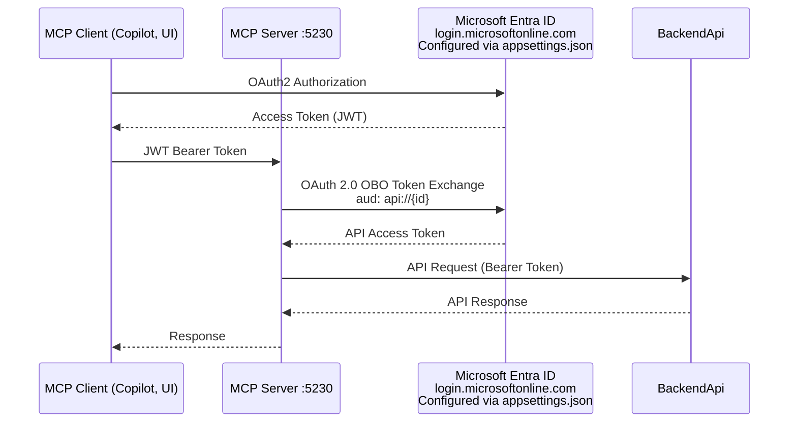

# MCP Server — OAuth2-Secured Model Context Protocol Server

## Overview

The MCP Server is an OAuth2-secured [Model Context Protocol](https://modelcontextprotocol.io/) server built with .NET 10 and Microsoft Entra ID. It exposes **8 MCP tools** across 3 tool classes and **4 MCP prompts** across 2 prompt classes, protected by JWT Bearer authentication. Backend API calls use OAuth 2.0 On-Behalf-Of (OBO) token exchange.

The server runs as part of a .NET Aspire-orchestrated solution. Token lifecycle: client authenticates with Entra ID, sends JWT to the MCP Server, server validates and authorizes, then exchanges the token (OBO) to call the downstream API.

- **Base URL**: `http://localhost:5230`
- **Transport**: [Streamable HTTP](https://modelcontextprotocol.io/specification/2025-03-26/basic/transports#streamable-http) (`/mcp`)
- **MCP SDK**: `ModelContextProtocol.AspNetCore` v1.3.0
- **Target Framework**: .NET 10
- **Identity Provider**: Microsoft Entra ID (OAuth 2.0 OBO Flow)

## Architecture

The MCP Server follows [Clean Architecture](https://blog.cleancoder.com/uncle-bob/2012/08/13/the-clean-architecture.html) with four layers, each in its own project. Dependency direction flows inward: Domain has zero dependencies, each outer layer depends only on inner layers.

```
MCP-Server/
├── McpServer.Domain/           # Innermost: permission constants, validation rules (zero dependencies)
├── McpServer.Application/      # Use cases, service contracts, models, configuration
├── McpServer.Infrastructure/   # HTTP clients, MSAL OBO, telemetry, health checks
└── McpServer.Presentation/     # MCP tools, prompts, middleware, composition root
```

```
McpServer.Domain
    ↑
McpServer.Application
    ↑
McpServer.Infrastructure
    ↑
McpServer.Presentation
```

Each layer has its own README with implementation details:

- [McpServer.Domain/README.md](McpServer.Domain/README.md): permission constants, task validation rules
- [McpServer.Application/README.md](McpServer.Application/README.md): use cases, `IDownstreamApiService`, `ITokenExchangeService`, `McpToolResult`, `DownstreamApiOptions`
- [McpServer.Infrastructure/README.md](McpServer.Infrastructure/README.md): `AuthenticatedApiClient`, `DownstreamApiService`, `EntraIdTokenExchangeService`, telemetry, health checks
- [McpServer.Presentation/README.md](McpServer.Presentation/README.md): tools, prompts, middleware, telemetry filter, extensions, composition root

### Token Flow



1. **Client authenticates** with Entra ID using the appropriate OAuth 2.0 flow for its client type (see [docs/OAUTH2-FLOWS-BY-CLIENT.md](../../docs/OAUTH2-FLOWS-BY-CLIENT.md)).
2. **Client calls MCP Server** with `Authorization: Bearer <token>`.
3. **Server validates JWT**: issuer, audience (`api://{client-id}`), and lifetime.
4. **Authorization** is enforced at class level via `[Authorize]` — all authenticated users can invoke any tool.
5. **For backend API tools**: Server performs OBO flow via MSAL to get a new token with `aud: api://{api-client-id}`. Token passthrough is not supported.

For details on the OBO flow, see [Microsoft identity platform and OAuth 2.0 On-Behalf-Of flow](https://learn.microsoft.com/entra/identity-platform/v2-oauth2-on-behalf-of-flow).

## Tools Catalog

### TaskTools (`McpServer.Presentation/Tools/TaskTools.cs`)

User-scoped task management. Tasks are keyed by user ID in the backend. Validation uses `TaskRules` from `McpServer.Domain/Rules/`.

| Tool Name            | Description                              | Parameters                                                                     |
| -------------------- | ---------------------------------------- | ------------------------------------------------------------------------------ |
| `get_tasks`          | Get all tasks for the authenticated user | (none)                                                                         |
| `create_task`        | Create a new task                        | `title` (string), `description` (string), `priority` (string: Low/Medium/High) |
| `update_task_status` | Update a task's status                   | `taskId` (string), `status` (string: Pending/In Progress/Completed)            |
| `delete_task`        | Delete a task by ID                      | `taskId` (string)                                                              |

### ProjectsTools (`McpServer.Presentation/Tools/ProjectsTools.cs`)

Backend project management tools.

| Tool Name             | Description                           | Parameters           |
| --------------------- | ------------------------------------- | -------------------- |
| `get_projects`        | Get list of projects from backend API | (none)               |
| `get_project_details` | Get project details by ID             | `projectId` (string) |

### BalancesTools (`McpServer.Presentation/Tools/BalancesTools.cs`)

Backend financial balance tools.

| Tool Name             | Description                                                 | Parameters                                                                         |
| --------------------- | ----------------------------------------------------------- | ---------------------------------------------------------------------------------- |
| `get_project_balance` | Get financial balance for a project                         | `projectId` (string)                                                               |
| `transfer_budget`     | Transfer budget between projects (cannot be undone)         | `sourceProjectId` (string), `targetProjectId` (string), `amount` (decimal)        |

## Prompts Catalog

MCP Prompts provide reusable prompt templates that AI clients can invoke for structured analysis. All prompts require authentication.

### TaskPrompts (`McpServer.Presentation/Prompts/TaskPrompts.cs`)

| Prompt Name               | Description                           | Arguments                                                  |
| ------------------------- | ------------------------------------- | ---------------------------------------------------------- |
| `summarize_tasks`         | Generate a summary of all user tasks  | `status` (string, optional: Pending/In Progress/Completed) |
| `analyze_task_priorities` | Analyze task distribution by priority | (none)                                                     |

### ProjectPrompts (`McpServer.Presentation/Prompts/ProjectPrompts.cs`)

| Prompt Name        | Description                             | Arguments                      |
| ------------------ | --------------------------------------- | ------------------------------ |
| `analyze_project`  | Detailed analysis of a specific project | `projectId` (string, required) |
| `compare_projects` | Compare all projects side-by-side       | (none)                         |

## Authorization

All tools and prompts require a valid JWT Bearer token (`[Authorize]` at class level). No App Role enforcement is applied in code — any authenticated user with a token accepted by the configured audience can invoke any tool or prompt.

## OBO Security Posture

`AuthenticatedApiClient` (in Infrastructure) never forwards the user's original JWT to downstream APIs. Every call goes through an OAuth 2.0 On-Behalf-Of (OBO) token exchange via `ITokenExchangeService`. The exchanged token has a different audience (`aud: api://{downstream-client-id}`), ensuring the downstream API validates a token issued specifically for it.

This is stronger than token passthrough because:

- The downstream API never accepts tokens intended for the MCP Server's audience.
- Scopes are narrowed to exactly what the downstream API exposes.
- Token lifetime is controlled independently by Entra ID for each leg.
- Compromise of a downstream token does not grant access to the MCP Server.

This is a non-negotiable security invariant for all onboarded MCP servers in this baseline.

### MSAL OBO Cache Isolation

MSAL partitions OBO tokens by the SHA-256 hash of the incoming `UserAssertion`, so each user gets an isolated cache entry automatically. The `IConfidentialClientApplication` is registered as a singleton, reusing the same in-memory cache across requests.

The default in-memory cache is adequate for single-instance deployments. For multi-instance or multi-agent deployments, replace with a distributed token cache (e.g., `AddDistributedTokenCache` with Redis) to avoid redundant token exchanges and maintain cache consistency across instances.

## OAuth/RFC Endpoints

### RFC 9728: Protected Resource Metadata

```
GET /.well-known/oauth-protected-resource
```

Returns (anonymous access):

```json
{
  "resource": "http://localhost:5230",
  "authorization_servers": [
    "https://login.microsoftonline.com/{tenant-id}/v2.0"
  ],
  "bearer_methods_supported": ["header"],
  "resource_documentation": "https://github.com/cristofima/mcp-oauth2-security-baseline"
}
```

Used by MCP clients to discover which authorization server to use. See [RFC 9728](https://datatracker.ietf.org/doc/html/rfc9728).

### RFC 8414: OAuth Authorization Server Metadata (Proxy)

```
GET /.well-known/oauth-authorization-server
```

Proxies to the Microsoft Entra ID OpenID configuration endpoint. MCP clients expect OAuth AS metadata on the resource server itself (same-origin discovery, per [RFC 8414](https://datatracker.ietf.org/doc/html/rfc8414)).

### MCP Transport

| Endpoint | Method | Purpose                                                                                                                                   |
| -------- | ------ | ----------------------------------------------------------------------------------------------------------------------------------------- |
| `/mcp`   | POST   | [Streamable HTTP](https://modelcontextprotocol.io/specification/2025-03-26/basic/transports#streamable-http) transport (request/response) |

Requires `Authorization: Bearer <token>`.

## Configuration

### EntraIdServerOptions

Bound from the `"EntraId"` section with startup validation via `[Required]` + `ValidateOnStart()`.

| Key                             | Description                | Required |
| ------------------------------- | -------------------------- | -------- |
| `EntraId:Instance`              | Azure AD instance URL      | Yes      |
| `EntraId:TenantId`              | Azure AD tenant ID         | Yes      |
| `EntraId:ClientId`              | Application (client) ID    | Yes      |
| `EntraId:ClientSecret`          | Client secret              | Yes      |
| `EntraId:Scopes`                | Scopes for OBO flow        | No       |
| `EntraId:ResourceDocumentation` | RFC 9728 documentation URL | No       |

### DownstreamApiOptions

Bound from the `"DownstreamApi"` section. Under Aspire, `BaseUrl` is set via `DownstreamApi__BaseUrl` env var in `AppHost.cs`. Without Aspire, set in `appsettings.*.json`.

| Key                      | Description                        | Required |
| ------------------------ | ---------------------------------- | -------- |
| `DownstreamApi:BaseUrl`  | Base URL for downstream API        | Yes      |
| `DownstreamApi:Audience` | Target audience for token exchange | Yes      |
| `DownstreamApi:Scopes`   | Scopes for OBO flow                | No       |

### Sample Configuration

```json
{
  "EntraId": {
    "Instance": "https://login.microsoftonline.com",
    "TenantId": "your-tenant-id",
    "ClientId": "your-client-id",
    "ClientSecret": "your-client-secret",
    "Scopes": ["api://your-client-id/.default"]
  },
  "DownstreamApi": {
    "Audience": "api://mock-api-client-id",
    "Scopes": ["api://mock-api-client-id/.default"],
    "BaseUrl": "http://localhost:5050"
  }
}
```

Configuration classes: `EntraIdServerOptions` in `McpServer.Infrastructure/Configuration/` (inherits from `EntraIdBaseOptions` in `McpServer.Shared/Configuration/`), `DownstreamApiOptions` in `McpServer.Application/Configuration/`.

## Observability

The MCP Server produces three telemetry signals via the OpenTelemetry SDK, configured centrally in `McpServer.ServiceDefaults`:

- **Traces**: ASP.NET Core, HttpClient, plus custom `McpActivitySource` for tool execution spans
- **Metrics**: ASP.NET Core, HttpClient, Runtime, plus custom `McpMetrics` for tool invocation counters and response times
- **Logs**: Serilog (Console + File sinks) bridged to OTel via `writeToProviders: true`

All tool telemetry (activities, metrics, structured logging) is centralized in `McpTelemetryFilter`, a single CallTool filter registered in the MCP SDK pipeline. Tools contain only business logic, no telemetry code.

For per-signal details, see [McpServer.Presentation/README.md](McpServer.Presentation/README.md#observability). For the OTel SDK pipeline and health check filtering, see [McpServer.ServiceDefaults/README.md](../McpServer.ServiceDefaults/README.md).

## Running

### Via .NET Aspire (recommended)

```powershell
cd src/McpServer.AppHost
dotnet run
```

Starts MCP Server and BackendApi together with automatic service discovery. Open the Aspire Dashboard (URL in console) to monitor traces, metrics, and logs.

### Standalone

```powershell
cd src/MCP-Server/McpServer.Presentation
dotnet run
```

Requires Microsoft Entra ID configured with appropriate App Roles. See [docs/ENTRA-ID-TESTING-GUIDE.md](../../docs/ENTRA-ID-TESTING-GUIDE.md).

## File Structure

```
MCP-Server/
├── McpServer.Domain/                         # Innermost layer (zero dependencies)
│   ├── Constants/Permissions.cs                # mcp: prefixed App Role constants
│   └── Rules/TaskRules.cs                      # Validation: priorities, statuses, max lengths
│
├── McpServer.Application/                    # Contracts and models (depends on Domain)
│   ├── Abstractions/IDownstreamApiService.cs   # Downstream API contract (JsonElement returns)
│   ├── Abstractions/ITokenExchangeService.cs   # Token exchange contract
│   ├── Configuration/DownstreamApiOptions.cs   # Downstream API connection settings
│   ├── Constants/McpJsonOptions.cs             # JSON serialization presets
│   ├── Models/McpToolResult.cs                 # Standardized tool result envelope
│   ├── UseCases/                               # One use case per tool operation
│   └── ApplicationServiceExtensions.cs         # AddApplication() registration
│
├── McpServer.Infrastructure/                 # Implementations (depends on Application + Shared)
│   ├── Configuration/EntraIdServerOptions.cs   # Entra ID config for MCP Server (inherits EntraIdBaseOptions)
│   ├── Http/AuthenticatedApiClient.cs          # Abstract base: OBO exchange, HTTP, JSON parsing
│   ├── Http/DownstreamApiService.cs            # Implements IDownstreamApiService (thin one-liners)
│   ├── Identity/EntraIdTokenExchangeService.cs # Implements ITokenExchangeService (MSAL OBO)
│   ├── Telemetry/McpActivitySource.cs          # OpenTelemetry tracing for MCP tools
│   ├── Telemetry/McpMetrics.cs                 # OpenTelemetry metrics for tool execution
│   ├── Health/EntraIdHealthCheck.cs            # Entra ID connectivity readiness check
│   └── Extensions/                             # AddInfrastructure() registration
│
├── McpServer.Presentation/                   # MCP tools, prompts, middleware, composition root
│   ├── Program.cs                              # Minimal startup: AddApplication → AddInfrastructure → AddPresentation
│   ├── Tools/                                  # 4 tool classes (8 tools total)
│   ├── Prompts/                                # 3 prompt classes (6 prompts total)
│   ├── Telemetry/McpTelemetryFilter.cs         # Centralized CallTool telemetry filter
│   ├── Middleware/McpCorrelationMiddleware.cs   # Session ID and trace context propagation
│   └── Extensions/                             # Auth, CORS, rate limiting, MCP server setup
│
└── README.md                                   # This file
```

## Design Decisions

1. **Clean Architecture in four projects**: Domain → Application → Infrastructure → Presentation. Each layer is a separate .csproj with explicit dependency direction. The MCP Server is stateless: it validates inputs, calls the backend API, and wraps raw `JsonElement` responses in `McpToolResult`. No entities, DTOs, or deserialization.

2. **Use cases in Application**: One sealed class per tool operation. Contains validation logic, orchestrates `IDownstreamApiService` calls, returns `McpToolResult`. Tools delegate to use cases via `ExecuteAsync()` and return `result.ToJson()`.

3. **Token exchange only (no passthrough)**: OBO is mandatory. If exchange fails, the request fails. This enforces proper audience separation between services.

4. **Centralized tool telemetry**: `McpTelemetryFilter` handles all observability. Tool classes inject use cases only, no `ILogger`, `Stopwatch`, or `Activity`.

5. **`McpTelemetryFilter` stays in Server**: It depends on `ModelContextProtocol.Protocol` types (`CallToolRequestParams`, `CallToolResult`), which are MCP SDK types. Moving it to Infrastructure would add an MCP SDK dependency to a layer that should not have it.

6. **Composition root in `Program.cs`**: Minimal (~44 lines): `.AddApplication().AddInfrastructure(configuration).AddPresentation(configuration, environment)`. Each layer registers its own services.

7. **IOptions with startup validation**: `EntraIdServerOptions` and `DownstreamApiOptions` use `[Required]` + `ValidateOnStart()`. Misconfiguration fails fast at startup.

See each layer's README for layer-specific design decisions.
